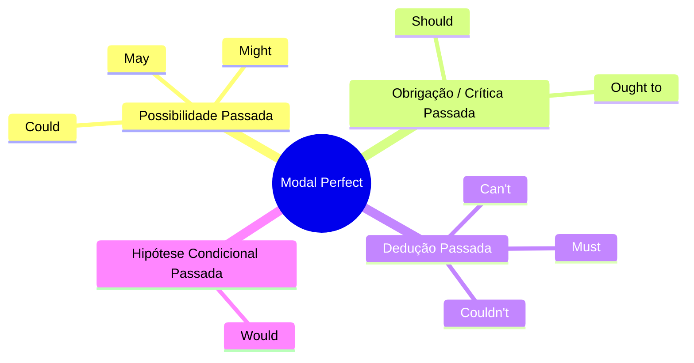

# Modal Perfect

> Ideia central: expressam julgamento, possibilidade, obrigação ou hipótese sobre **ações passadas**.

## Estrutura

| Forma | Estrutura | Exemplo |
| - | - | - |
| **Afirmativa** | \${\color{gray}suj}\$ + \${\color{purple}modal}\$ +  \${\color{yellow}have}\$ +  \${\color{pink}3ª\ forma}\$ | `She must have left early.`         |
| **Negativa** | \${\color{gray}suj}\$ + \${\color{purple}modal}\$ + \${\color{red}not}\$ + \${\color{yellow}have}\$ +  \${\color{pink}3ª\ forma}\$ | `He might not have seen the email.` |
| **Interrogativa** | \${\color{purple}modal}\$ + \${\color{gray}suj}\$ + \${\color{yellow}have}\$ +  \${\color{pink}3ª\ forma}\$ | `Could you have finished earlier?`  |

> \[!TIP]
> Usado quando a fala se refere a um **passado hipotético ou incerto**.
> O verbo principal **sempre** fica no **past participle**.

## Divisão

## 1. Possibilidade Passada

> Algo que poderia ou pode ter acontecido, mas sem certeza.

* Could

  > Ex.: `I could have joined the call, but I was busy.` 

* Might / May

  > Ex.: `She might have missed the deadline.` 
  > Ex.: `The system may have crashed overnight.` 

## 2. Obrigação / Crítica Passada

> Expressa o que era esperado ou recomendado, mas não foi feito.

* Should

  > Ex.: `You should have updated the document.` 

* Ought to

  > Ex.: `He ought to have informed the team.` 

## 3. Dedução Passada

> Indica quase certeza sobre o que aconteceu ou não aconteceu.

* Must

  > Ex.: `They must have fixed the bug already.` 

* Can’t / Couldn’t

  > Ex.: `She can’t have written this code alone.` 
  > Ex.: `He couldn’t have accessed the server without a password.` 

## 4. Hipótese Condicional Passada

> Situações que teriam acontecido em outras condições.

* Would

  > Ex.: `I would have deployed the update if the tests had passed.` 

