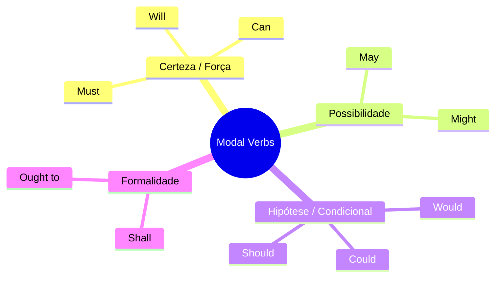

# Modal Verbs

> Ideia central: expressam possibilidade, capacidade, obrigação, permissão, probabilidade ou conselho.
> Sempre seguidos pela **1ª forma do verbo** (sem *to*), exceto no caso de **ought to**.

## Estrutura

| Forma | Estrutura | Exemplo |
| - | - | - |
| **Afirmativa**| \${\color{gray}suj}\$ + \${\color{yellow}modal}\$ + \${\color{green}1ª\ forma}\$ | `I can swim`|
| **Negativa** | \${\color{gray}suj}\$ + \${\color{yellow}modal}\$ + \${\color{red}not}\$ + \${\color{green}1ª\ forma}\$ | `I cannot (can’t) swim` |
| **Interrogativa** | \${\color{yellow}modal}\$ + \${\color{gray}suj}\$ + \${\color{green}1ª\ forma}\$| `Can you swim?`|

> \[!TIP]
> Os modais **não variam** (não têm *-s* no presente, nem formas no passado, exceto `could` e `would`).
> **Ought** é exceção: vem seguido de **to + verbo**.

## Divisão

## 1. Certeza / Força

> São mais usados para afirmar ou negar sobre a capacidade e competência do sujeito realizar uma determinada ação.

* Will / Will not: $$^{certeza}$$

  > Ex.: `I will finish the report tomorrow.` 
  > Ex.: `I will not attend the meeting.` 
* Can / Can't (Cannot): $$^{capacidade}$$

  > Ex.: `She can solve this problem.` 
  > Ex.: `He can’t drive a car.` 
* Must / Must not: $$^{dever}$$

  > Ex.: `You must wear a seatbelt.` 
  > Ex.: `You must not enter this room.` 

## 2. Possibilidade

> Expressam algo que pode acontecer, sem certeza absoluta, variando em grau de probabilidade.

* May

  > Ex.: `It may rain later.` 
  > Ex.: `You may leave early.` 
* Might

  > Ex.: `He might call tonight.` 
  > Ex.: `We might find a solution.` 

## 3. Hipótese / Condicional

> Usados para situações hipotéticas, recomendações e condições não garantidas.

* Would / Would not: $$^{hipotese}$$

  > Ex.: `I would travel if I had money.` 
  > Ex.: `She wouldn’t accept that offer.` 
* Could / Could not: $$^{hipotese}$$

  > Ex.: `We could try another approach.` 
  > Ex.: `I couldn’t open the file.` 
* Should / Should not: $$^{recomendacao}$$

  > Ex.: `You should see a doctor.` 
  > Ex.: `He shouldn’t be late.` 

## 4. Formalidade

> Usados em contextos formais, jurídicos ou em inglês britânico mais tradicional.

* Shall: $$^{certeza}$$

  > Ex.: `We shall meet again.` 
  > Ex.: `The company shall provide insurance.` 
* Ought to: $$^{recomendacao}$$

  > Ex.: `You ought to respect the rules.` 
  > Ex.: `She ought to apologize.` 

