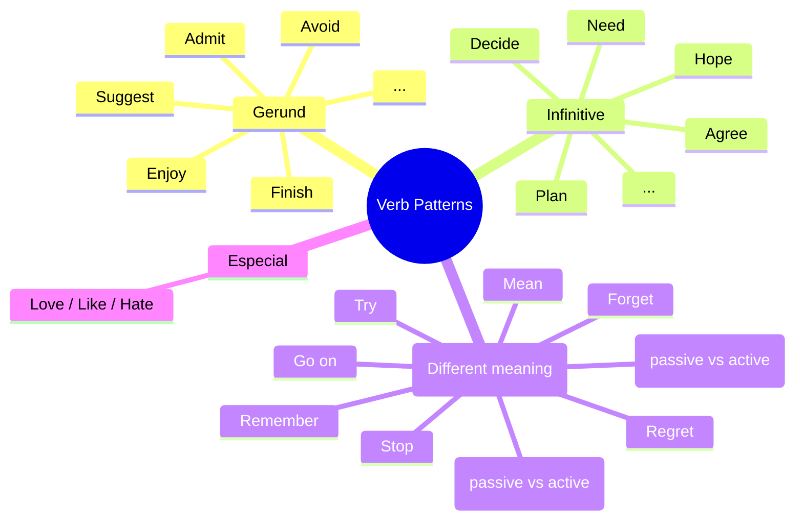

# Verb Patterns

> Ideia central: alguns verbos em inglês exigem que o próximo verbo esteja no **gerúndio (-ing)**, no **infinitivo (to + base form)**, ou aceitam **ambas as formas** com diferença de sentido.
> Esse padrão é fixo e precisa ser memorizado para cada verbo.

## Estrutura

| Forma                          | Estrutura                                                                                                | Exemplo                                      |
| ------------------------------ | -------------------------------------------------------------------------------------------------------- | -------------------------------------------- |
| **Gerúndio**                   | \${\color{gray}suj}\$ + \${\color{yellow}verbo}\$ + \${\color{purple}verbo - ing}\$              | `She enjoys reading.`                        |
| **Infinitivo**                 | \${\color{gray}suj}\$ + \${\color{yellow}verbo}\$ + \${\color{green}1ª\ forma}\$             | `He decided to study.`                       |
| **Ambos (mudança de sentido)** | \${\color{gray}suj}\$ + \${\color{yellow}verbo}\$ + \${\color{purple}verbo - ing}$ ou \${\color{green}1ª\ forma}\$ | `I stopped smoking.` / `I stopped to smoke.` |

> \[!TIP]
> O padrão **não depende do tempo verbal**. O verbo principal pode estar no passado, presente ou futuro — a forma exigida pelo **segundo verbo** não muda.
> Ex.: `They enjoyed playing.` / `They will enjoy playing.`

## Divisão

## 1. Verbos seguidos de **Gerúndio** (-ing)

> Geralmente para atividades, hábitos ou ações gerais.

* Admit: `He admitted stealing the money.`
* Avoid: `She avoids driving at night.`
* Consider: `I considered moving to Canada.`
* Deny: `He denied cheating on the test.`
* Enjoy: `I enjoy reading books.`
* Finish: `They finished studying at 10 PM.`
* Imagine: `Can you imagine living on Mars?`
* Keep: `She keeps talking all the time.`
* Mind: `Do you mind helping me?`
* Miss: `I miss traveling with my family.`
* Postpone:	`We postponed going to the beach`
* Practice:	`He practices playing the guitar every day.`
* Quit:	`She quit smoking last year.`
* Risk: `He risked losing all his money.`
* Suggest: `She suggested going out for dinner.`

## 2. Verbos seguidos de **Infinitivo** (to + verbo)

> Geralmente ligado a intenção, decisão ou futuro.

* Agree: `She agreed to help us.`
* Decide: `He decided to study abroad.`
* Hope: `I hope to see you soon.`
* Learn: `He learned to drive last year.`
* Need: `We need to leave now.`
* Offer: `She offered to cook dinner.`
* Plan: `They plan to travel next summer.`
* Promise: `He promised to call me later.`
* Refuse: `She refused to go to the party.`
* Seem:	`He seems to be tired.`
* Want: `I want to learn English.`

## 3. Verbos seguidos de **Gerúndio ou Infinitivo** 

> Alguns verbos mudam de significado dependendo da forma usada.

* Forget

  * `I forgot meeting her.` (esqueci que já aconteceu)
  * `I forgot to meet her.` (esqueci de fazer)

* Stop

  * `He stopped smoking.` (parou a atividade)
  * `He stopped to smoke.` (parou outra coisa **para** fumar)
 
* Try

  * `She tried restarting the PC.` (tentou como experiência/teste)
  * `She tried to restart the PC.` (tentou, mas era difícil/não conseguiu)

* Remember

  * `I remember locking the door.` (lembro que fiz isso)
  * `Remember to lock the door.` (não esqueça de fazer)

* Regret

  * `I regret saying that.` (me arrependo do que já fiz)
  * `I regret to inform you…` (formal: lamento informar algo agora)

* Need / Want

  * `The house needs cleaning.` (passivo implícito = precisa **ser limpa**)
  * `I need to clean the house.` (ativo = eu preciso limpar)

* Mean
  * `This job means working late hours.` (significar / implicar)
  * `I meant to call you yesterday.` (pretender / ter intenção de)

* Go on
  * `He went on talking for hours.` (continuar a mesma ação)
  * `After the break, she went on to explain the new project.` (mudar para outra ação)

## 4. Verbos especiais: **Love, Like, Hate**

> Esses verbos podem usar **-ing** ou **to + verbo**.
> A diferença é de **ênfase**:
>
> * **-ing**: foco na **atividade em geral**.
> * **to + verbo**: foco em um **momento específico** ou no **resultado**.

* Love

  * `She loves reading novels.` (ação em geral)
  * `She loves to read before bed.` (hábito específico)

* Like

  * `I like swimming.` (atividade no geral)
  * `I like to swim in the morning.` (momento específico)

* Hate

  * `They hate waking up early.` (ação em geral)
  * `They hate to wake up at 5 AM.` (momento específico)

